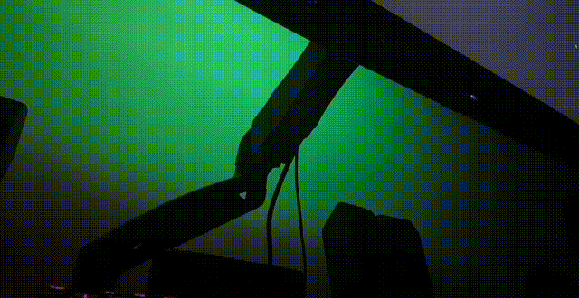

# Synesthesia
This project uses a [Teensy 3.2](https://www.pjrc.com/store/teensy32.html) to control an LED strip based on the sound output of your computer.

---

## Dependencies
- [Teensy Audio Library](https://github.com/PaulStoffregen/Audio)
- [Adafruit NeoPixel Library](https://github.com/adafruit/Adafruit_NeoPixel)

## Setup
1. Change the variables NUM\_LEDS and LED\_PIN to the number of LEDs in your strip and the pin you are using, if needed
2. Upload the sketch to your Teensy
3. Send your audio output to your Teensy
    - (Windows) [Use Window's stereo mix](https://answers.microsoft.com/en-us/windows/forum/windows_10-hardware/output-audio-to-multiple-devices-in-windows-10/b284def2-d684-4f1f-87a0-f562f556aedd?auth=1) or download a [virtual audio mixer](https://www.vb-audio.com/Voicemeeter/index.htm).
